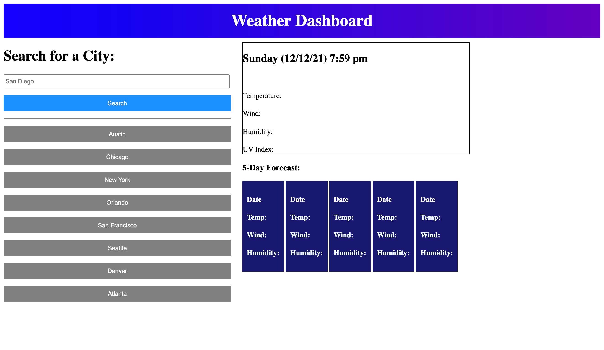

# weather-dashboard-snowflake
My 6th Challenge of the Bootcamp, a weather guide for a specific area that the user selects.

## What is this?
This application is my 6th challenge of the bootcamp. The user types in the city they want, and from there they will see that current date, time, wind speed, humidity, UV Index, and temperature. They can also see the 5 day forecast for this city below. I listed popular cities they could search for on the left side of the screen.

## How did I make it?
I used CSS, Javascript and HTML to create this app. 

## Where can I find it?
This can either be found on my GitHub Repository page (https://github.com/mmlawton15/weather-dashboard-snowflake), or at the Live URL (https://mmlawton15.github.io/weather-dashboard-snowflake/).

## What does it look like?
